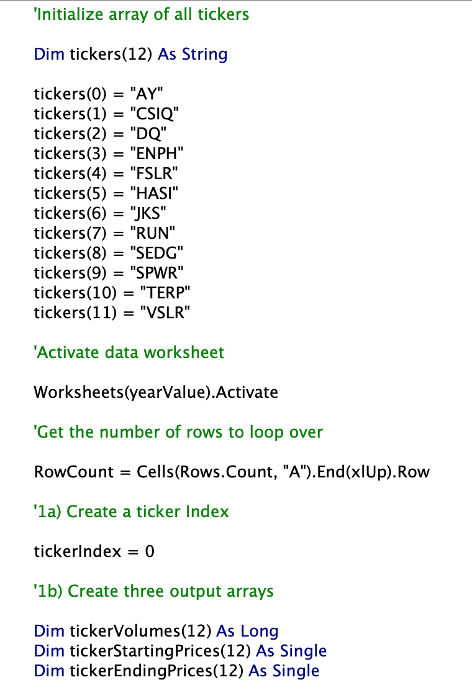
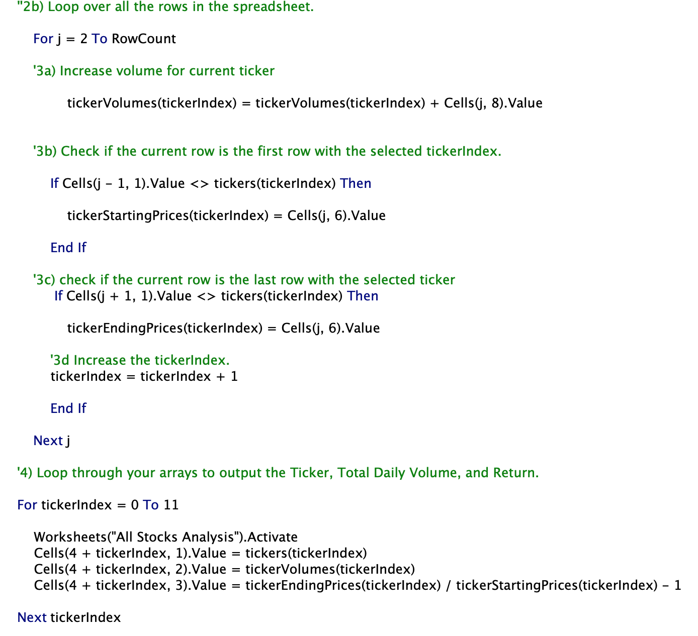
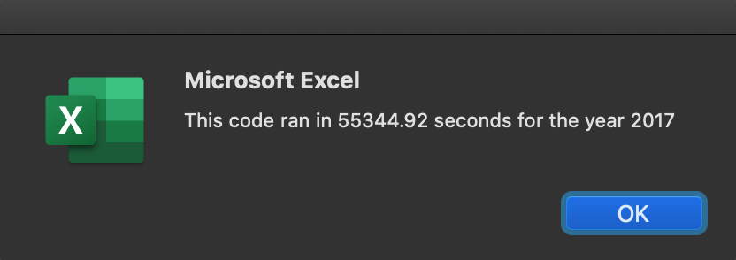
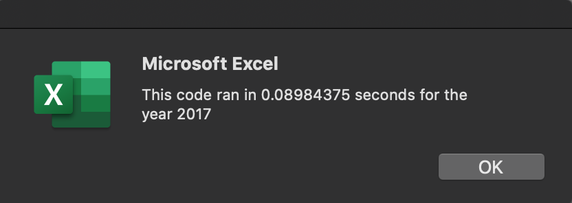
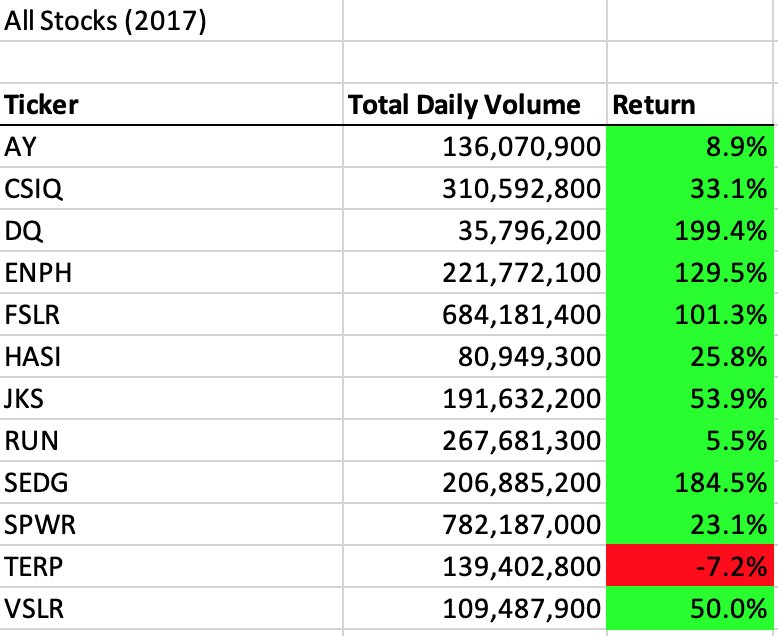
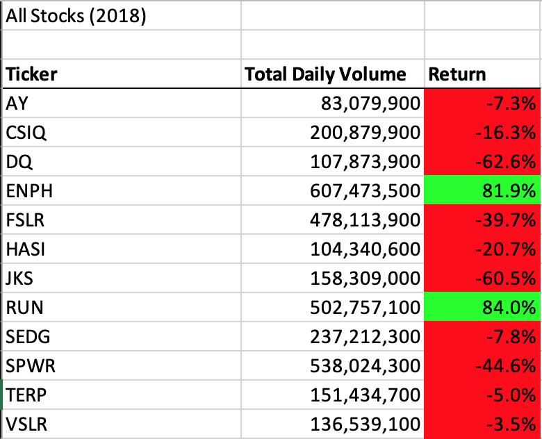

# VBA of Wallstreet

## Overview of Project

### Purpose

The purpose of this exercise was to refactor the code from the Module 2 solution to help Steve potentially expand his dataset in the future without hindering performance.

## Results

After refactoring the code and creating arrays and a ticker index and watching the code cycle through in the Locals window it became pretty obvious of the advantages of using an index, especially if you were to have a large dataset.

Looping through the arrays using the ticker index and then using the ticker index to output the results was a more efficient way to write this code compared to the code written in the module.

When I compared the results of the execution times of the 2017 & 2018 stocks from both the original code from Module 2 and the refactored code in the VBA challenge there was a significant difference. If we were looking at thousands of stocks instead of 12 it would play a big factor in which code we used.

Module 2 Execution Times:

VBA Challenge Exection Times:

Results from 2017 and 2018 Worksheets

## Summary

Some of the advantages of refactoring code in general would be to save time. If someone has already wrote a piece of code that does the job, why not use it? It is also a way to make existing code more efficient by improving the logic and taking fewer steps. A disadvantage of refactoring someone else's code might be that some learning experience might be lost by not writing your own code from scratch.

The advantages of the original VBA code might be that it got the job done in a short amount of time in a small dataset. A disadvantage would be that it could take longer to run and use more memory with larger datasets. The advantage of the refactored VBA code is the it is more efficient I would most likely handle large datasets with ease. The disadvantage would be that it took longer to write and might not be the best way if needing a quick result.

### Links
[VBA Challenge Excel Document](VBA_Challenge.xlms)
